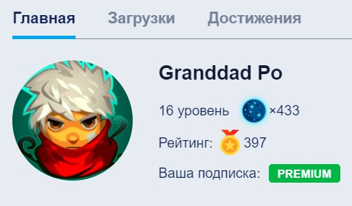

# **Vitaliy Potapov**
## Junior Frontend Developer


***
## Contact information:
**Phone:** +7 (999) 100 41 51\
**E-mail:** granddad.po@gmail.com\
**Telegram:** @granddad_po\
**Discord:** Granddad Po\#4279\
**GitHub:** [Granddad-Po](https://github.com/Granddad-Po)

***

## About Myself:

After moving to St. Petersburg, he began his journey with photography, but more as a hobby. Then I switched to vector graphics and web design, managed to take several paid courses.

About a year ago I had the pleasure to get acquainted with the IT sphere in the person of the Java programming language. A deep interest flared up. Realized that Java is just one of a thousand development tools. Having opened before myself all the completeness and diversity of the IT sphere, my attention was attracted by Web development that combines the Design, with which I am already familiar, and the code itself.

Now, I devote all my free time to learning Frontend. In the future, I would like to become a Full Stack Developer.

***

## Skills and Proficiency:

* HTML, CSS, SASS
* Java Core
* Git
* MySQL
* IntelliJ IDEA, VS Code, MySQL Workbench
* Adobe Photoshop, Lightroom, Illustrator, Figma

***

## Code Example:

This code demonstrates the use of basic encryption using a numeric key to encrypt and decrypt a text message. The whole point is to raise each character in the string to a power by the numeric value of the key. We do the same for decryption.
```
public class Encryption {
    public static void main(String[] args) {

        String str = "Testing for experience";
        String encmsg = "";
        String decmsg = "";

        int key = 88;

        System.out.println(str);

        for (int i = 0; i < str.length(); i++)
            encmsg = encmsg + (char) (str.charAt(i) ^ key);

        System.out.println("Encrypted message: " + encmsg);

        for (int i = 0; i < str.length(); i++)
            decmsg = decmsg + (char) (encmsg.charAt(i) ^ key);

        System.out.println("Decrypted message: " + decmsg);
    }
}
```

***

## Courses:

* Exploring Java on [JavaRush](https://javarush.ru/) and reading a variety of books\

* HTML, CSS, JavaScript in YouTube channel: [Фрилансер по жизни - IT и фриланс](https://www.youtube.com/c/FreelancerLifeStyle) and course "Академия верстки. WebStart"

***

## Languages:

* Russian - native
* **English - A2 (Elementary)**
